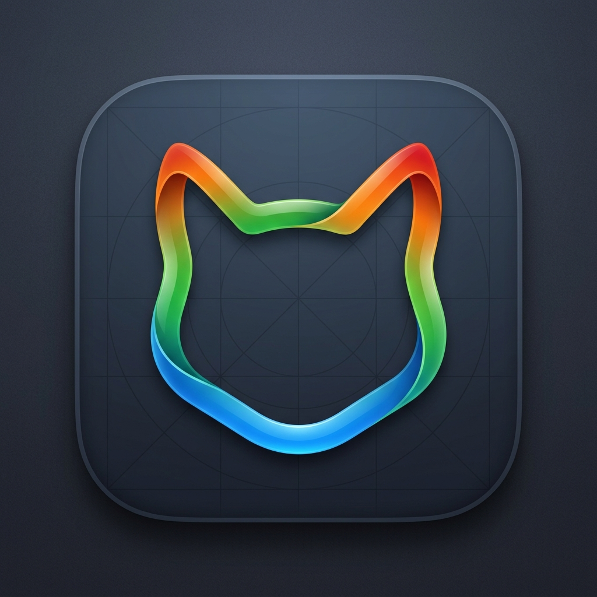
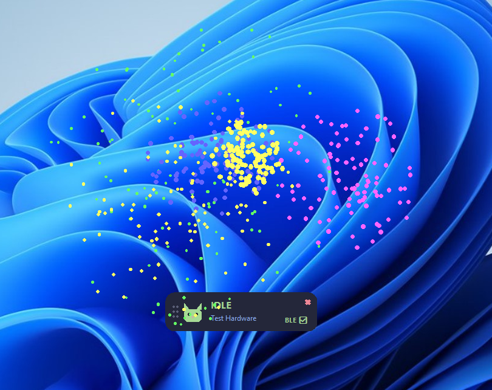

<div align="center">
  
# 🐾 AgyPet (桌面反重力宠物)



**一个动态、跨平台的桌面虚拟伴侣与 AI 硬件联动桥梁。**

[](https://www.python.org/downloads/)
[](https://opensource.org/licenses/MIT)
[]()

[English](README.md) | [简体中文](README_zh.md)

</div>

---

## 📖 项目简介

**AgyPet** 不仅仅是一个桌面宠物。它是一个强大的跨平台桥梁，旨在将您的 AI Agent（例如 Antigravity IDE 等智能体）的运行状态，通过屏幕视觉和物理硬件实时具象化。

当您的 AI 处于“思考中”、“等待人工审批”或“报错”等状态时，AgyPet 会瞬间做出反应：
1. **桌面悬浮窗 UI**：一个无边框、支持极致透明的现代美学悬浮窗，带有流畅的 GIF 动画和生动的提示语音。
2. **物联网硬件联动**：通过低功耗蓝牙 (BLE) 或串口将状态码实时发送至外部单片机 (如 ESP32、Arduino)，从而物理点亮外接的 LED、驱动舵机或蜂鸣器。

---

## 🖼️ 视听效果预览

### 多套专属 AI 语音包
AgyPet 内置了多种风格的语音配置文件（主人、爸爸、老板、哥哥、宝贝）。快来试听几段 **"主人"** 版本的音频示例：
- 🟢 [空闲待机 (Idle)](assets/sounds/zhuren/idle.mp3)
- 🔵 [思考中 (Thinking)](assets/sounds/zhuren/thinking.mp3)
- 🟠 [等待审批 (Waiting)](assets/sounds/zhuren/waiting.mp3)
- 🔴 [执行报错 (Error)](assets/sounds/zhuren/error.mp3)

### 桌面悬浮窗状态
<p align="center">
  
  
  
  
</p>

### 核心动态引擎素材
<p align="center">
  
  
  
  
</p>

### 任务完成满屏烟花特效
<p align="center">
  
</p>

---

## ✨ 核心特性

- 🖥️ **跨平台系统托盘**：完美支持 Windows 和 macOS。采用了真正独立的多进程系统托盘驻留架构，彻底绕过了 macOS 臭名昭著的主线程 UI 限制与崩溃 Bug。
- 🎆 **任务完成满屏烟花**：当 AI 成功完成任务时，瞬间引爆算法生成的全屏透明烟花。**针对 macOS 最新加入了苹果原生 Cocoa (PyObjC) 渲染引擎**，打破 Tkinter 限制，实现极致且不留黑框的透明穿透效果！
- 🛜 **硬件连接支持**：内置了针对 BLE（低功耗蓝牙）MAC/名称扫描和传统 USB 串口（SPP）的直连功能，带有自动重连机制。
- 🎨 **现代美学设计**：无边框圆角胶囊 UI 设计，采用 Catppuccin 高级配色方案，搭配自研透明 GIF 渲染引擎。
- ⚙️ **图形化热插拔配置**：自带设置面板，可随时切换目标蓝牙设备、串口号或 Agent 日志监听目录，无需重启即可立即生效。
- 🌐 **HTTP Webhook 联动**：如果不想玩物理硬件，也支持将 AI 状态改变实时以 POST 格式推送至任意配置的 Webhook URL。
- 🗣️ **多套配音方案切换**：支持随时切换不同的人格语音方案（爸爸、主人、老板、哥哥、宝贝），定制你的专属陪伴。
- 🪶 **静默后台模式**：提供 `main.py` 命令行入口，无需桌面 UI，可直接作为守护进程运行在无头服务器上。

---

## 🚀 快速开始

### 1. 环境安装
请确保您已安装 Python 3.10 或更高版本。

```bash
# 克隆代码库
git clone https://github.com/YourUsername/agy-pet.git
cd agy-pet

# 创建并激活虚拟环境
python -m venv venv
# Windows:
.\venv\Scripts\activate
# macOS/Linux:
source venv/bin/activate

# 安装所需依赖
pip install -r requirements.txt
```

### 2. 运行项目
您可以直接运行带有 UI 的完整桌面宠物模式：
```bash
pythonw src/app.py
```
或者在服务器环境下运行纯命令行桥接模式：
```bash
python src/main.py --mode ble --ble-name AgyPet
```

## 🔌 硬件接入指南

AgyPet 会发送 1字节 的十六进制状态码给外部单片机：
* `0x01` = IDLE (空闲)
* `0x02` = THINKING (思考中)
* `0x03` = WAITING_CONFIRM (等待人工审批)
* `0x04` = ERROR (执行报错)

### 1. 串口接入示例 (USB/SPP)
适用于 Arduino Nano、ESP32 等任意自带串口的开发板。
```cpp
void setup() {
  Serial.begin(115200);
  pinMode(LED_BUILTIN, OUTPUT);
}

void loop() {
  if (Serial.available() > 0) {
    int state = Serial.read();
    
    if (state == 0x01) {
      digitalWrite(LED_BUILTIN, LOW); // 熄灭
    } else if (state == 0x02) {
      digitalWrite(LED_BUILTIN, HIGH);
      delay(100);
      digitalWrite(LED_BUILTIN, LOW); // 快闪
    } else if (state == 0x03) {
      digitalWrite(LED_BUILTIN, HIGH); // 常亮
    }
  }
}
```

### 2. 蓝牙低功耗接入示例 (BLE)
对于 ESP32，强烈推荐使用高度优化的 `h2zero/NimBLE-Arduino` 库（解决 Windows WinRT 底层由于安全策略导致的 GATT 服务连接经常报错崩溃的问题）。

```cpp
#include <NimBLEDevice.h>

// ⚠️ 必须与 AgyPet 内置的 UUID 保持一致
#define SERVICE_UUID        "4fafc201-1fb5-459e-8fcc-c5c9c331914b"
#define CHARACTERISTIC_UUID "beb5483e-36e1-4688-b7f5-ea07361b26a8"

class MyCallbacks: public NimBLECharacteristicCallbacks {
    void onWrite(NimBLECharacteristic *pCharacteristic) {
      std::string value = pCharacteristic->getValue();
      if (value.length() > 0) {
        uint8_t state = (uint8_t)value[0]; 
        if (state == 0x00) return; // 忽略防休眠心跳包
        
        Serial.printf("接收到状态: 0x%02X\n", state);
      }
    }
};

void setup() {
  Serial.begin(115200);

  // 启用高级安全配置，否则 Windows 可能会拒绝与其配对连接
  NimBLEDevice::setSecurityAuth(true, true, true);
  NimBLEDevice::setSecurityIOCap(BLE_HS_IO_NO_INPUT_OUTPUT);
  NimBLEDevice::setSecurityInitKey(BLE_SM_PAIR_KEY_DIST_ENC | BLE_SM_PAIR_KEY_DIST_ID);

  NimBLEDevice::init("AgyPet"); // 设备名称
  NimBLEServer *pServer = NimBLEDevice::createServer();
  NimBLEService *pService = pServer->createService(SERVICE_UUID);
  
  NimBLECharacteristic *pCharacteristic = pService->createCharacteristic(
                                         CHARACTERISTIC_UUID,
                                         NIMBLE_PROPERTY::READ | NIMBLE_PROPERTY::WRITE | NIMBLE_PROPERTY::WRITE_NR
                                       );
  uint8_t initialState = 0x01;
  pCharacteristic->setValue(&initialState, 1);
  pCharacteristic->setCallbacks(new MyCallbacks());
  pService->start();
  
  NimBLEAdvertising *pAdvertising = NimBLEDevice::getAdvertising();
  pAdvertising->addServiceUUID(SERVICE_UUID);
  pAdvertising->setAppearance(0x03C0); // ⚠️ 关键属性：将其伪装为游戏手柄(Gamepad)，迫使 Windows 蓝牙设置主动显示它
  pAdvertising->setScanResponse(true);
  NimBLEDevice::startAdvertising();
}

void loop() { delay(2000); }
```

> **⚠️ Windows 蓝牙配对必读**: 
> 由于 Windows 严格的底层安全策略，您**必须**先在 `Windows系统设置 -> 蓝牙和其他设备` 中手动点击配对该设备（设备会显示为一个 🎮 游戏手柄图标），然后 AgyPet 桌面端才能成功连接。如果不配对直接连，必定会抛出 "Device Not Found" 或 "Unreachable" 报错！

### 3. 连接排错指南
如果 AgyPet 无法连接到您的物理硬件，您可以轻松查看底层日志：
1. **右键**点击桌面的 AgyPet 宠物悬浮窗。
2. 选择 **`📂 Open Hardware Log`**。
3. 系统将自动打开 `agypet_hardware.log` 文本文件，里面包含了带时间戳的所有后台蓝牙扫描、串口握手、以及数据发包记录，极易排查故障。

---

## 🧪 本地虚拟测试指南

如果您手头没有真实的单片机或开发板，可以利用下方的测试工具模拟测试 AgyPet 的通信。

### 1. HTTP Webhook 模拟器 (最便捷)
运行内置的 Webhook 测试脚本，它会在屏幕上弹出一个纯色悬浮窗，模拟真实物理 LED 灯的效果：
```bash
python tests/mock_webhook_hardware.py
```
*请在 AgyPet 设置面板中，将 Webhook URL 填为：`http://127.0.0.1:8888`*

### 2. 串口模拟测试 (需安装虚拟串口驱动)
要在单台电脑上测试串口通信，您必须下载如 `com0com` (Windows) 等虚拟串口驱动，创建一对互相连通的虚拟串口（例如 `COM3` 连通 `COM4`）。
```bash
python tests/mock_serial_hardware.py
```
*在 AgyPet 设置中连接至 `COM3`，然后上方脚本会自动监听在 `COM4` 并在终端打印接收到的十六进制状态码。*

---

## 📦 编译打包发行版

### ☁️ 云端全自动打包 (推荐方案)
本项目已完整配置了 **GitHub Actions** CI/CD 流程。您不需要拥有真实的 Mac 或 Linux 电脑，就能轻松编译所有的跨平台应用文件！
1. 打开您的 GitHub 仓库页面的 **Actions** 标签。
2. 点击侧边栏的 **Cross-Platform Release**，然后点击 **Run workflow**。
3. 喝口水的时间（约2分钟），GitHub 服务器就会全自动帮您完成编译，并打包提供 Windows `.exe` 和 macOS `.dmg` 的独立执行程序下载包！

### Windows 本地打包 (.exe)
```cmd
.\build.bat
```

### macOS 本地打包 (.app 与 .dmg)
```bash
bash build_mac.sh
```

---

## 🤝 参与贡献
作为一个极其开放的极客开源项目，我们张开双臂欢迎任何形式的代码贡献、Pull Requests (PR)、Issue 以及奇思妙想！

## 📄 开源协议
本项目采用 MIT 宽松开源协议。查看 `LICENSE` 获取更多信息。
